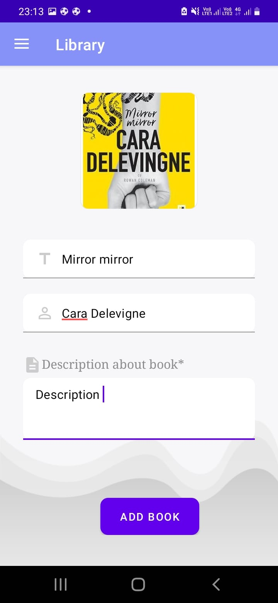
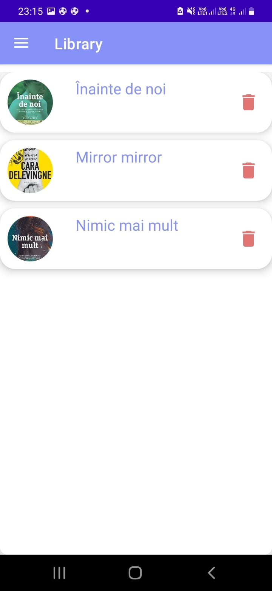
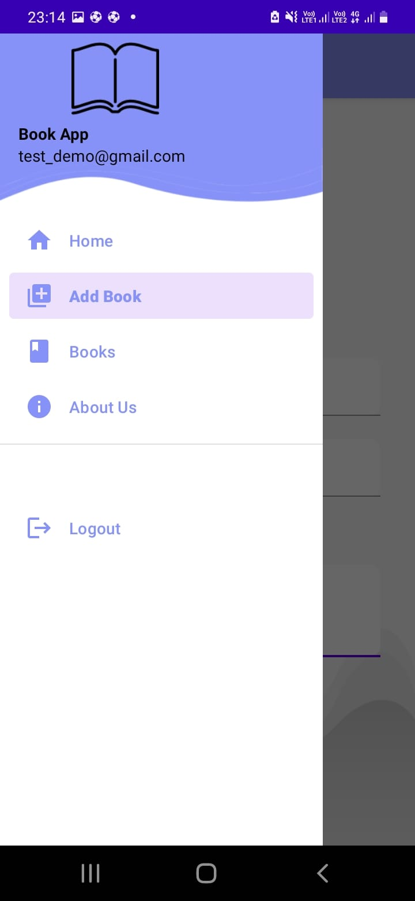

# Virtual Library - Android App Using Firebase

This Android application allows users to store and manage their favorite books in a virtual library. The app is built using Firebase for user authentication and data storage.

## Features

- **User Authentication**  
  - Users can create an account or log in using Firebase Authentication.  
  - Secure and easy-to-use authentication system.  

- **Book Management**  
  - Add new books to the virtual library.  
  - View, edit, and delete books as needed.  
  - Store book details such as title, author, and description.  

## Screenshots

### 1. Create Account  
  

### 2. Login Interface  
  

### 3. Main Interface  
  

### 4. Book Management Layout  
  

### 5. Add Book Details  


### 6. Example of Added Books  


### 7. User's Library View  


### 8. Application Menu  


## Technologies Used  

- **Firebase Authentication** – Secure user login and registration.  
- **Firebase Realtime Database** – Store and manage book data.  
- **Android Studio** – Development environment.  
- **Java/Kotlin** – Programming language for Android development.  

## Installation  

1. Clone the repository:  
   ```sh
   git clone https://github.com/yourusername/virtual-library.git
